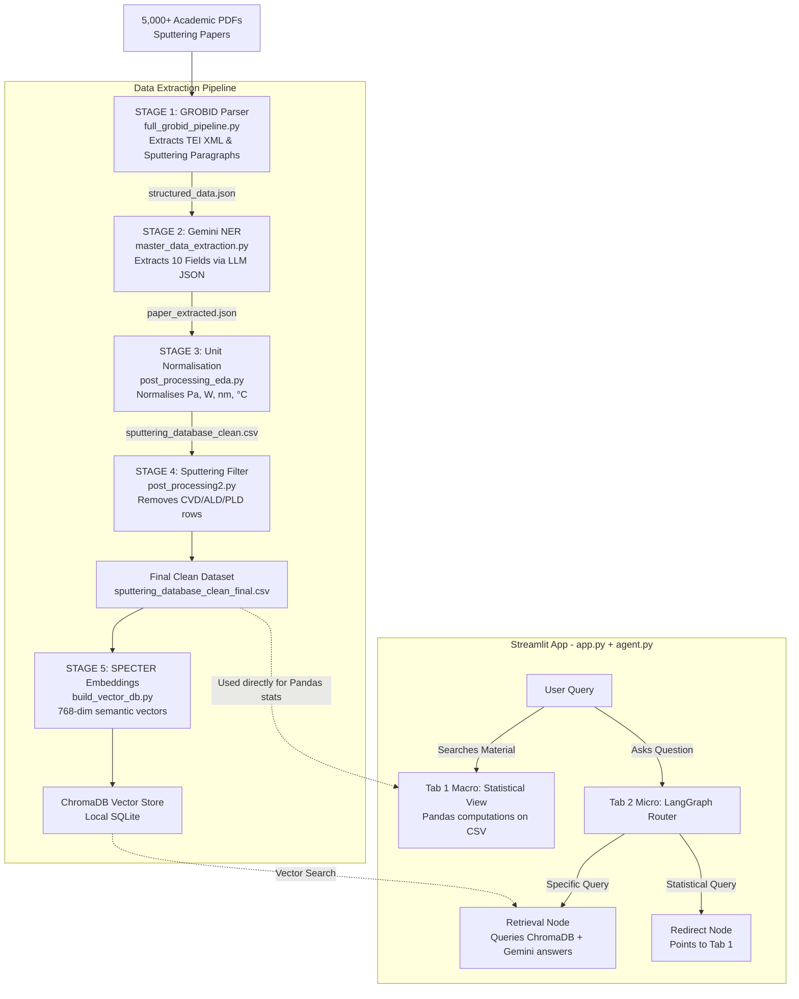

# Sputtering RAG AI

**Automated Literature Review + AI Assistant for Thin-Film Sputtering Research**

Developed at IIT Kanpur — Materials Science Department

---

## Table of Contents

1. [What This Project Does](#1-what-this-project-does)
2. [The Problem It Solves](#2-the-problem-it-solves)
3. [Full Architecture](#3-full-architecture)
4. [Tech Stack — Every Choice Explained](#4-tech-stack--every-choice-explained)
5. [The Pipeline — Stage by Stage](#5-the-pipeline--stage-by-stage)
6. [The Application — Two-Tab Design](#6-the-application--two-tab-design)
7. [Key Design Decisions](#7-key-design-decisions)
8. [How to Run](#8-how-to-run)
9. [Project File Map](#9-project-file-map)

---

## 1. What This Project Does

This system ingests **5,000+ academic research papers** on thin-film sputtering deposition,
extracts structured experimental parameters from them using a Large Language Model (LLM),
builds a semantic vector database, and exposes everything through an interactive dashboard with:

- **Macro view**: Statistical analysis of parameters across all papers for any material
- **Micro view**: An AI chatbot that answers specific questions grounded strictly in the database

In plain terms: a researcher types *"ZnO"* and instantly gets the mean deposition power,
median working pressure, most common substrate, and parameter distribution charts — aggregated
from hundreds of papers they would otherwise need to read manually.

---

## 2. The Problem It Solves

### The Context

Thin-film sputtering is a physical vapour deposition technique used to grow nanometer-scale
films for solar cells, sensors, LEDs, and hard coatings. To deposit a specific material
(e.g. Zinc Oxide — ZnO), a researcher needs to know what parameters actually work:

- What RF power should I use?
- At what pressure does the process run?
- Which substrate is most common?
- What gas mixture is standard?

### The Old Way

A researcher manually reads 50–200 papers. Each paper buries the parameters inside
methodology sections written in different notation systems (MTorr vs. Pa, kW vs. W/cm²).
There is no central database. This takes days to weeks.

### What This System Does

1. Parses the PDFs into structured text using a scientific XML parser (GROBID)
2. Sends each paper's text to an LLM with a precise extraction prompt
3. The LLM reads the methodology section and outputs a clean JSON with 10 standard fields
4. A conversion engine normalises all units to SI (Pa, W, nm, °C)
5. The clean data is stored in a CSV (5,293 rows) and embedded in a vector database
6. A Streamlit dashboard answers statistical queries (pandas) and semantic queries (RAG)

**The researcher gets the same output in seconds instead of days.**

---

## 3. Full Architecture



---

## 4. Tech Stack — Every Choice Explained

### 4.1 GROBID — PDF Parser

**What it does**: Converts academic PDFs into structured TEI XML, identifying titles,
abstracts, section headings, body paragraphs, references, and tables.

**Why GROBID over alternatives**:

| Option | Problem |
|---|---|
| PyPDF2 / pdfplumber | Extracts raw text with no structure. A table might extract as garbled text. Sections are not labelled. |
| Adobe PDF API | Paid, requires cloud, returns flat text |
| LLM-based PDF parsing | Expensive (large context), hallucination risk for page layout |
| **GROBID** | Free, open source, trained specifically on scientific papers, preserves document structure as XML |

GROBID is the tool used by Semantic Scholar and CrossRef for parsing millions of papers.
It is the gold standard for academic PDF parsing. A free public server exists at
`kermitt2-grobid.hf.space`.

**Key advantage for this project**: GROBID correctly identifies the *Experimental* or
*Methods* section — exactly where sputtering parameters live. PyPDF2 cannot do this.

---

### 4.2 Gemini 2.5 Flash — LLM for Named Entity Recognition (NER)

**What it does**: Reads a paper's abstract + methodology text and extracts 10 structured
fields as JSON. This is LLM-as-a-structured-extractor, not LLM-as-a-chatbot.

**Why Gemini over alternatives**:

| Option | Problem |
|---|---|
| spaCy / NLTK NER | Traditional NER cannot extract domain-specific numeric values with units from unstructured prose |
| Fine-tuned BERT | Would need thousands of labelled training examples to fine-tune. Not available here. |
| GPT-4 | Works equally well but significantly more expensive per token |
| **Gemini 2.5 Flash** | Free tier with generous limits, fast, follows complex JSON schema instructions reliably |

**Why not use the LLM for statistics too?** This is a deliberate architectural decision.
LLMs hallucinate numbers. If you ask "what is the average power for ZnO?", a chatbot will
confidently give you a wrong number. This project uses the LLM only for:
1. Extracting information from text (where it excels)
2. Grouping semantic aliases (where it excels)

Statistics are computed by pandas from the actual database values (no hallucination possible).

**The few-shot prompt (3 examples)**: The extraction prompt includes 3 real examples of
paper text → expected JSON output before the actual paper text. This pattern (called
few-shot prompting) measurably improves accuracy for edge cases: ranges ("100-200 W"),
scientific notation ("5×10⁻³ Torr"), implied values ("room temperature").

---

### 4.3 SPECTER — Scientific Embedding Model

**What it does**: Converts each paper's parameter record into a 768-dimensional vector
that captures semantic meaning. Similar records cluster together in vector space.

**Why SPECTER over alternatives**:

| Option | Problem |
|---|---|
| `all-MiniLM-L6-v2` (ChromaDB default) | Trained on general English text. Does not understand "HiPIMS", "MTorr", "sputtering yield" as scientific concepts. A query for "high power deposition" might retrieve unrelated results. |
| `text-embedding-004` (Google) | Cloud API — requires internet + API key every time the app queries. Adds latency and cost per search. |
| `SciBERT` | Trained on 1.14M scientific papers via masked language modelling (MLM). MLM is good at token-level tasks (classification, NER) but not optimised for semantic similarity. |
| **`allenai-specter`** | Trained specifically for *document-level scientific similarity*. The training task was: "given paper A and paper B which A cites, embed them close together." This directly matches our use case: "given query Q about sputtering parameters, find the most relevant paper records." Runs 100% locally. No API key. |

**Why local over cloud embedding?**
- The app must work offline (lab environments may have restricted internet)
- No per-query cost (5,293 papers × many queries would be expensive via API)
- SPECTER is cached locally after first download — subsequent app starts are instant

---

### 4.4 ChromaDB — Vector Database

**What it does**: Stores the SPECTER embeddings and performs Approximate Nearest Neighbour
(ANN) search when a query arrives.

**Why ChromaDB**:

| Option | Problem |
|---|---|
| Pinecone / Weaviate | Cloud-hosted. Requires account, API key, internet. Not suitable for local research tool. |
| FAISS (Facebook) | Library, not a database. No persistence layer. Requires manual save/load. No metadata filtering. |
| Qdrant | Good choice, but heavier to set up (Docker). Overkill for a single-machine research tool. |
| **ChromaDB** | Zero-configuration, file-based persistence (`chroma.sqlite3`), native Python API, supports metadata filtering, open source. Perfect for local research tools. |

At 5,293 vectors, performance is near-instant on CPU. ChromaDB would scale to ~1M vectors
before requiring a dedicated server.

---

### 4.5 LangChain — AI Application Framework

**What it does**: Provides composable building blocks for LLM-powered features in `app.py`:
- `ChatGoogleGenerativeAI`: wrapper over Gemini with a standard interface
- `ChatPromptTemplate`: structured prompts with typed variables (system + human roles separate)
- `PydanticOutputParser`: enforces that the LLM's alias-grouping response parses into a
  typed Python object, not a raw string

**Why LangChain over raw Gemini SDK calls**:

The original code used the raw `google.generativeai` SDK:
```python
# Before
response = model.generate_content(prompt_string)
text = response.text  # raw string, manually parsed
```

Problems with raw SDK:
1. Everything is one string blob — no separation between system instructions and user input.
   LLMs follow `system` role instructions more strictly than instructions buried in `user` text.
2. No composability — can't chain prompt → model → parser with `|` operator
3. Output parsing is manual `.split(',')` which breaks on any edge case

With LangChain:
```python
chain = prompt | llm | PydanticOutputParser(MaterialAliases)
result = chain.invoke({"material": "ZnO", ...})
# result.aliases is a typed list[str], guaranteed
```

**Important**: The pipeline scripts (`master_data_extraction.py`) still use the raw Gemini
SDK because they run outside the app, don't need composability, and the few-shot f-string
prompt is clearer for that context. LangChain is used only where it adds real value: the app.

---

### 4.6 LangGraph — Agentic Router

**What it does**: Implements the chatbot routing logic as a state machine (directed graph)
with typed state, nodes, and conditional edges.

**Why LangGraph over a prompt-based guardrail**:

The original guardrail was a prompt instruction:
```
CRITICAL RULE: If the user asks for statistics, reply with: "I am the Micro bot..."
```

This is fragile. LLMs can ignore prompt instructions, especially in long conversations.

With LangGraph, routing is enforced in Python code:
```
User Query → Router Node (LLM classifies: "specific" or "statistical")
    ├── "specific"   → Retrieval Node → answer from database
    └── "statistical" → Redirect Node → "please use Tab 1"
```

The retrieval node is **literally unreachable** from a statistical query — it's not a
request to the LLM, it's a graph edge condition evaluated in Python. This is the difference
between a suggestion and a constraint.

**Why LangGraph over a simple if-else?**
For two routes, an if-else would be fine. LangGraph's value shows at 5+ routes:
an agent that can also look up DOIs, check if a material exists, fetch related papers, etc.
The graph structure makes complex routing maintainable. This project intentionally uses
LangGraph's simplest form to demonstrate the pattern.

---

### 4.7 Pydantic — Schema Validation

**What it does**: Defines a strict schema for LLM JSON output and validates every response
before it is written to disk or passed to the next pipeline stage.

**Why this matters**:

Without validation, if Gemini returns:
```json
{"Material": "ZnO", "Power": "150W", "Substrate": null}
```

The pipeline writes it to disk as-is. Later, `post_processing_eda.py` crashes trying to
parse `null` as a string, or silently writes NaN everywhere. The bug is invisible.

With Pydantic:
```python
class ExtractionResult(BaseModel):
    Material: str
    Substrate: str
    Power: str
    ...  # all 10 fields required, all must be str

validated = ExtractionResult.model_validate_json(raw_response)
```

If any field is missing or null → `ValidationError` is caught, the paper is skipped,
and the error is logged to `extraction_errors.log` with the raw response. The database
remains clean.

---

### 4.8 Streamlit — Dashboard Framework

**Why Streamlit over React/Vue/Flask+JS**:

A research dashboard's users are domain scientists, not web developers. The development
priorities are:
1. Correctness of the data analysis
2. Speed of iteration on features
3. Interactive charts and tables

Streamlit converts Python data science code directly into a web UI. A Plotly histogram
that would require 3 files (HTML, CSS, JS) in React takes 1 line in Streamlit:
```python
st.plotly_chart(px.histogram(df, x="Power_W", nbins=50, marginal="box"))
```

The trade-off is design flexibility — Streamlit apps look like Streamlit apps.
For a research tool used by scientists, this is the right trade-off.

---

## 5. The Pipeline — Stage by Stage

### Stage 1: PDF → Structured JSON (`full_grobid_pipeline.py`)

**Input**: Raw GROBID TEI XML files (one per paper)

**What GROBID does first** (before this script):
- Takes a PDF and sends it to the GROBID server
- GROBID uses machine learning models to identify document structure
- Returns TEI XML with labelled sections: `<title>`, `<abstract>`, `<body><div>` etc.

**What this script does**:
1. Parses the XML with BeautifulSoup using the `xml` parser
2. Extracts title, abstract, and body sections
3. For each paragraph in the body, runs a keyword filter (30+ sputtering terms)
4. Keeps only paragraphs containing sputtering-relevant content
5. Saves per-paper `structured_data.json`

**Why keyword filter here?**
Each paper has ~20-50 paragraphs. Sending all of them to the LLM in Stage 2 would:
- Use more tokens (higher cost)
- Dilute the relevant content (lower extraction accuracy)
- Hit context length limits for long papers

The keyword filter keeps the methodology section and discards introduction, conclusion, and
references. This reduces token count by ~70% with negligible information loss.

**Output format**:
```json
{
  "paper_id": "paper_slug",
  "title": "ZnO thin films deposited by...",
  "abstract": "We report...",
  "sections": [
    {"heading": "Experimental", "text": "Films were deposited by RF sputtering..."}
  ]
}
```

---

### Stage 2: Structured JSON → Extracted Parameters (`master_data_extraction.py`)

**Input**: `structured_data.json` per paper

**The 3-shot few-shot prompt**:

Three calibration examples are shown before each paper's text:

```
TEXT: "ZnO films were deposited on glass by RF magnetron sputtering at 150 W..."
OUTPUT: {"Material": "ZnO", "Substrate": "Glass", "Power": "150 W", ...}

TEXT: "TiN coatings were grown by DC reactive sputtering from a Ti target..."
OUTPUT: {"Material": "TiN", "Deposition_Method": "DC Reactive Sputtering", ...}

TEXT: "ITO electrodes were prepared by HiPIMS on PET flexible substrates..."
OUTPUT: {"Material": "ITO", "Deposition_Method": "HiPIMS", ...}

Now extract from:
{actual paper text}
```

Why 3 examples? Without examples (zero-shot), the LLM handles edge cases inconsistently:
- "2 kW peak" → sometimes extracts as "2 kW", sometimes as "2000 W"
- "room temperature" → sometimes "RT", sometimes "25°C", sometimes "Not specified"
- Ranges "100-200 W" → sometimes takes midpoint, sometimes takes lower bound

With 3 examples that cover these cases, the LLM calibrates to a consistent style.

**API key rotation**:
Free Gemini API keys have per-minute and daily rate limits. The script:
- Loads all keys from `.env` (GEMINI_API_KEY_1, GEMINI_API_KEY_2, ...)
- Sleeps 4.5 seconds between calls (rate limit compliance)
- On quota exhaustion: tries 3 times, then rotates to next key
- Saves progress after each paper so the job can resume after a pause

**Pydantic validation**:
Every LLM response is validated before writing. Failures are logged and skipped cleanly.

**Output**: Per-paper `_extracted.json` files:
```json
{
  "Material": "ZnO",
  "Substrate": "Glass",
  "Deposition_Method": "RF Magnetron Sputtering",
  "Target": "ZnO ceramic",
  "Power": "150 W",
  "Gas_Mixture": "Ar/O2 (4:1)",
  "Working_Pressure": "5 mTorr",
  "Base_Pressure": "Not specified",
  "Temperature": "300°C",
  "Film_Thickness": "500 nm"
}
```

---

### Stage 3: Unit Normalisation (`post_processing_eda.py`)

**The problem**: Different papers use different unit systems. To compute statistics across
all papers, every value must be in the same unit.

**What the normalisation engine does**:

| Parser | Handles | Converts to |
|---|---|---|
| `parse_pressure()` | MTorr, Torr, mbar, bar, Pa, and scientific notation | **Pa** |
| `parse_temperature()` | K, °C, "RT", "room temperature" | **°C** |
| `parse_thickness()` | Å, nm, μm, mm | **nm** |
| `parse_power()` | W, kW, mW, W/cm² (drops density) | **W** |
| `clean_gas_mixture()` | "Argon", "Ar + O2", "80% Ar 20% N2" | `Ar/O2/N2` canonical tags |

**Scientific notation handling**:
```
"5×10⁻³ Torr" → 5 × 10⁻³ × 133.322 Pa → 0.667 Pa
```

**Range handling**:
```
"100-200 W" → extracts first value: 100 W
```

**Outlier threshold**: Films thicker than 2,000 nm (2 μm) are excluded from EDA plots.
This is a documented constant (`thickness_outlier_threshold_nm` in `config.json`), not
a magic number. Most thin films are under 500 nm; values above 2 μm are usually bulk
coatings or measurement errors.

**Output**: `sputtering_database_clean.csv` with columns:
`Paper_ID, Material, Substrate, Method, Gas_Mixture_Std, Power_W, Working_Pressure_Pa, Base_Pressure_Pa, Temperature_C, Thickness_nm`

---

### Stage 4: Sputtering Filter (`post_processing2.py`)

**Why this stage exists**:
Stage 2's Gemini extraction is not perfect. Some non-sputtering papers slip through if
their text mentions sputtering incidentally (e.g. "unlike sputtering, we used CVD").

This stage filters the `Method` column for sputtering keywords:
`sputter, magnetron, hipims, ibs, ion beam, rfms, dcms, pulsed dc`

**Output**: `sputtering_database_clean_final.csv` — the final dataset (5,293 rows)

---

### Stage 5: Vector Database Build (`build_vector_db.py`)

**What gets embedded**:
Each row is formatted as a labelled key-value string:
```
Material: ZnO | Substrate: Glass | Deposition Method: RF Magnetron Sputtering |
Gas Mixture: Ar/O2 | Target Power: 150.0 W | Working Pressure: 0.667 Pa |
Base Pressure: Not specified | Substrate Temperature: 300.0 °C | Film Thickness: 500.0 nm
```

**Why this format over a sentence?**
The original format was:
```
"To deposit ZnO on a Glass substrate using RF Magnetron Sputtering..."
```

This reconstructed sentence collapses the distinction between fields — "ZnO" is just
another word in the sentence, not a labelled entity. The SPECTER model cannot identify
that "ZnO" is the material vs. "Glass" is the substrate vs. "500 nm" is thickness.

The labelled key-value format preserves all semantic distinctions and lets SPECTER match
on any combination of fields. A query like "low pressure ZnO on flexible substrate" will
correctly retrieve records with low Pa + ZnO + PET/PEN substrate.

**SPECTER embedding**:
Each string is passed through SPECTER → 768-dimensional float vector. ChromaDB stores
these vectors and the original strings together.

**Deduplication**: Before ingestion, `Paper_ID` duplicates are removed. Without this,
`collection.upsert()` would update the same document twice (wasted compute).

**`upsert()` vs `add()`**: `add()` throws `DuplicateIDError` if run twice on the same data.
`upsert()` updates existing documents safely. This means the build script is idempotent —
safe to re-run after adding new papers.

---

### Stage 6: Dashboard (`app.py` + `agent.py`)

See the next section for full details.

---

## 6. The Application — Two-Tab Design

### The Macro / Micro Split

This is the most important architectural decision in the entire system.

**Macro (Tab 1) = pandas math, LLM for grouping only**
**Micro (Tab 2) = LLM with retrieved context**

Why keep them separate?

LLMs are excellent at understanding language and context. They are unreliable for arithmetic
over large datasets. If you ask a chatbot "what is the mean power for ZnO?", it has two
bad options:
1. Try to compute from context (hallucination risk — it might invent a number)
2. Refuse (unhelpful)

The Macro tab computes mean/median/mode using pandas on the actual 5,293-row CSV.
This is mathematically exact and cannot hallucinate. The LLM's only role is to group
`["ZnO", "zinc oxide", "Zn0", "ZnO:Al"]` into one family — a language task it handles well.

### Tab 1: Statistical Overview (Macro)

**Flow**:
1. User types a material name (e.g. `ZnO`)
2. ChromaDB semantic search finds the 50 most relevant paper records
3. All unique material names from those 50 results are collected as candidates
4. `PydanticOutputParser` calls Gemini: *"which of these names belong to the ZnO family?"*
5. Gemini returns a typed `MaterialAliases(aliases=["ZnO", "zinc oxide", ...])` object
6. The CSV is filtered to only rows matching those aliases
7. pandas computes: mean, median, mode, min, max for Power, Temperature, Pressure
8. Plotly renders: substrate bar chart, power histogram, temperature histogram, pressure histogram

**Key details**:
- The substrate chart groups variants semantically (`"Corning glass"` and `"soda-lime glass"` both → `"Glass"`)
- Statistics use the actual filtered data, not LLM output
- `PydanticOutputParser` guarantees the alias list is a typed `list[str]`, not a raw string

### Tab 2: AI Chatbot (Micro)

**Flow**:
1. User asks a question (e.g. *"What power was used for YBCO on MgO substrate?"*)
2. **LangGraph Router Node**: Gemini classifies the query as `"retrieval"` or `"statistical"`
3a. If `"retrieval"`: ChromaDB semantic search retrieves top 10 matching paper records →
    Gemini reads them and answers, citing only what's in the database
3b. If `"statistical"`: Returns a redirect message pointing to Tab 1

**Chat memory**: The last 3 conversation exchanges are included in every prompt.
This means follow-up questions work correctly:

```
User: What parameters were used for ZnO?
AI:   [lists parameters from 3 papers]

User: What about the substrate?        ← "substrate" refers to ZnO context
AI:   [correctly understands this is still about ZnO, not a new query]
```

Without memory, the second question would be interpreted in isolation and might fail.

**The LangGraph guardrail (vs. prompt-based)**:

```python
# Old: fragile prompt instruction the LLM can ignore
"RULE 4: If user asks for statistics, reply with 'I am the Micro bot...'"

# New: graph edge — the retrieval node is unreachable from a statistical query
graph.add_conditional_edges("router", _route_decision, {
    "retrieval":   "retrieval",   # only reachable if router returns "retrieval"
    "statistical": "statistical", # redirect node — no database access
})
```

---

## 7. Key Design Decisions

### Why Not Use One Big Chatbot?

The naive approach: build one chatbot that handles everything. Give it access to the CSV,
the vector DB, and let it answer both statistical and specific questions.

**Problems**:
- LLMs cannot reliably compute statistics over thousands of rows
- No separation between "hallucinated knowledge" and "database knowledge"
- No clear grounding: which paper did this number come from?

The Macro/Micro split enforces an iron boundary: statistics come from pandas (exact),
specific information comes from retrieved database entries (grounded and cited).

### Why Store Extracted Fields, Not Full Paper Text?

A common RAG pattern embeds entire paper chunks and retrieves them.

For this domain, the goal is not to reproduce the paper — it's to extract specific numeric
values. If the full text is embedded and retrieved, the LLM must still parse the number
out of prose, reintroducing the same NER problem.

By running NER first (Stage 2) and storing structured fields, every query returns clean
`Power: 150 W`, not *"the film was deposited at a power of one hundred and fifty watts"*.

### Why `config.json` + `config_loader.py`?

Original: 6 scripts, each with hardcoded `D:\UGP_METHOD2\...` paths.
Effect: impossible to run on any other machine.

Solution: one `config.json` defines all paths as relative paths (`./data/grobid_xml`).
`config_loader.py` resolves them to absolute paths at runtime based on where the repo lives.

```python
from config_loader import config
INPUT_DIR = config.path("xml_input_dir")  # works on any machine, any OS
```

---

## 8. How to Run

### Prerequisites
- Python 3.10+
- A Gemini API key (for running the app — not for building the vector DB)

### First-time Setup

```bash
# 1. Install all dependencies
pip install -r requirements.txt
# Note: sentence-transformers downloads SPECTER (~400 MB) on first use

# 2. Set up API keys (for running the Gemini extraction pipeline only)
copy .env.example .env
# Edit .env: add GEMINI_API_KEY_1=your_key_here

# 3. Build the vector database (uses SPECTER locally — no API key needed)
#    If a vector_database/ folder exists from a previous run, delete it first:
rmdir /s /q vector_database   # Windows
rm -rf vector_database         # Mac/Linux

python build_vector_db.py
# Expected output:
#   [OK] 5293 unique papers ready for embedding.
#   Batch 1-100 / 5293 done
#   ...
#   [DONE] Vector Database built successfully!

# 4. Launch the dashboard
python -m streamlit run app.py
# Open http://localhost:8501 in your browser
# Enter your Gemini API key in the sidebar
```

### Running the Full Extraction Pipeline (optional — only if you have new papers)

```bash
# See all pipeline stages and their current status
python run_pipeline.py --list

# Run a specific stage
python run_pipeline.py --stage 2   # Run Gemini NER extraction
python run_pipeline.py --stage 5   # Rebuild vector DB only
python run_pipeline.py --from 3    # Run stages 3 through 6
python run_pipeline.py             # Run all stages
```

---

## 9. Project File Map

```
sputtering-rag-ai/
│
├── config.json                     All user-configurable settings and paths
├── config_loader.py                Shared path resolver imported by all scripts
├── .env.example                    API key template — copy to .env
├── .gitignore                      Prevents .env and data/ from being committed
├── requirements.txt                All dependencies with minimum versions
│
├── ── Pipeline Scripts ─────────────────────────────────────
│
├── full_grobid_pipeline.py         Stage 1: TEI XML → structured JSON
├── master_data_extraction.py       Stage 2: JSON → Gemini NER → extracted JSON
├── post_processing_eda.py          Stage 3: JSON → unit normalisation → CSV
├── post_processing2.py             Stage 4: CSV → sputtering filter → final CSV
├── build_vector_db.py              Stage 5: CSV → SPECTER embeddings → ChromaDB
├── run_pipeline.py                 Orchestrator: chains all 6 stages with CLI flags
│
├── ── Application ──────────────────────────────────────────
│
├── app.py                          Streamlit dashboard (Tab 1: Macro, Tab 2: Micro)
├── agent.py                        LangGraph router agent (3-node graph)
│
├── ── Data Assets ──────────────────────────────────────────
│
├── sputtering_database_clean_final.csv     Final clean dataset (5,293 papers)
└── vector_database/                         ChromaDB persistent store (SPECTER embeddings)
    ├── chroma.sqlite3
    └── [embedding data files]
```

---

## Glossary

| Term | Meaning |
|---|---|
| **Sputtering** | A physical vapour deposition technique where ions knock atoms off a target material, which then deposit onto a substrate |
| **RF Magnetron Sputtering** | Uses radio-frequency power + magnetic field to improve deposition efficiency |
| **HiPIMS** | High Power Impulse Magnetron Sputtering — uses high peak power in pulses |
| **Working Pressure** | Chamber gas pressure during deposition (typically 0.1–10 Pa) |
| **Base Pressure** | Vacuum pressure before deposition starts (typically 10⁻⁴ to 10⁻⁶ Pa) |
| **TEI XML** | Text Encoding Initiative XML — a standard format for structured scholarly text |
| **NER** | Named Entity Recognition — extracting structured information from unstructured text |
| **RAG** | Retrieval-Augmented Generation — LLM answers grounded in retrieved documents |
| **Vector embedding** | A high-dimensional numerical representation of text that captures semantic meaning |
| **ANN search** | Approximate Nearest Neighbour — fast similarity search in vector space |
| **Few-shot prompting** | Including examples in a prompt so the LLM learns the expected format/style |
