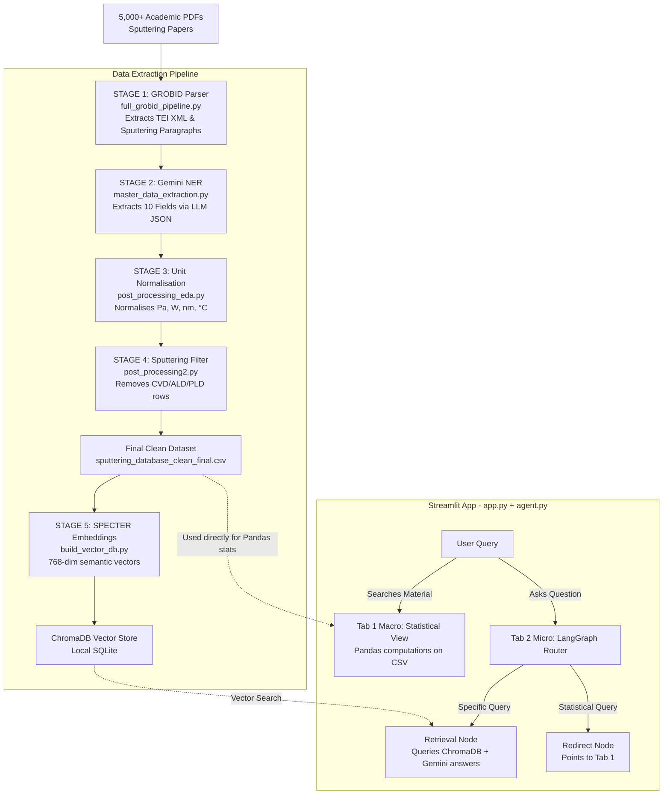

# Sputtering RAG AI — Complete Pipeline & Code Walkthrough

This document provides a developer-focused explanation of what is happening inside each key file of the pipeline. Read this to understand how the pipeline works under the hood so you can own, debug, and modify the code.

## The Architecture at a Glance

---

## 1. `config_loader.py` & `config.json`
**Purpose:** Single source of truth for all file paths and model settings.
- Instead of hardcoding paths like `D:\UGP_METHOD2\`, the code reads `config.json`.
- `config_loader.py` loads this JSON and resolves relative paths to absolute paths using Python's `pathlib.Path`.
- **Why it matters:** If you move the project to a new computer, you only change the paths in `config.json` (or keep them relative) and everything just works.

## 2. `full_grobid_pipeline.py` (Stage 1)
**Purpose:** Parses PDFs into JSON using GROBID.
- It reads `.tei.xml` files generated by the GROBID server using `BeautifulSoup(xml, "xml")`.
- It loops through `
` and `
` tags to extract the text from the paper's body.
- It applies a keyword filter (using a list of sputtering-related terms like 'magnetron', 'pressure'). If a paragraph doesn't contain any keywords, it's discarded. This saves thousands of LLM tokens and drops irrelevant data immediately.

## 3. `master_data_extraction.py` (Stage 2)
**Purpose:** The LLM engine that extracts data.
- It defines a Pydantic schema (`ExtractionResult`). This acts as a strict mold—the LLM **must** return data that fits this mold exactly (Material, Substrate, Power, Pressure, etc.), or Langchain throws an error.
- It loads all Gemini API keys from the `.env` file into a list.
- It uses a few-shot prompt (providing 3 examples of paper text + expected JSON) to teach the LLM how to format its answers, especially for edge cases like ranges (100-200 W) or scientific notation.
- If an API call fails due to rate limits (429 Error), the script catches the error, retries 3 times, and then rotates to the next API key in the list automatically.

## 4. `post_processing_eda.py` & `post_processing2.py` (Stages 3 & 4)
**Purpose:** Data cleaning and normalisation.
- **Stage 3:** These scripts use Regular Expressions (Regex) via Python's `re` module to find numbers and units (e.g., matching "5 mTorr").
- They apply mathematical conversions (e.g., Torr to Pa, Å to nm, K to °C) to standardise everything.
- **Stage 4:** `post_processing2.py` applies a final sanity check filter on the "Deposition Method" column to drop any rows that mention "CVD", "ALD", or "PLD" instead of sputtering, guaranteeing a pure sputtering dataset.

## 5. `build_vector_db.py` (Stage 5)
**Purpose:** Creates the ChromaDB semantic database.
- It loads the `allenai-specter` model locally using `SentenceTransformerEmbeddingFunction`. This model turns text into a 768-dimensional mathematical vector (an array of numbers).
- It takes the clean CSV and converts each row into a rich string format: `Material: ZnO | Substrate: Glass...`
- It connects to a local ChromaDB instance (`chromadb.PersistentClient`) and uses the `upsert()` method. Upsert means it adds new papers or updates existing ones without throwing duplicate errors.

## 6. `app.py` (Dashboard)
**Purpose:** The Streamlit UI and Tab 1 (Macro) logic.
- Uses `st.tabs(["Macro", "Micro"])` to split the UI into two sections.
- When you search a material in Tab 1, it queries ChromaDB for the top 50 matches for that material.
- It uses LangChain's `PydanticOutputParser` to ask Gemini to group material aliases (e.g., "ZnO" and "zinc oxide") into a strict Python list.
- It filters the Pandas DataFrame using this list, calculates statistics (mean, median), and plots charts using `plotly.express` (e.g., `px.histogram`).

## 7. `agent.py` (Chatbot Router)
**Purpose:** The brain behind Tab 2 (Micro).
- It defines a LangGraph `StateGraph`. The "state" is a dictionary containing the user's question, conversation history, and routing decision.
- **Node 1 (Router):** Asks Gemini to classify the user's question as either "statistical" or "retrieval".
- **Node 2 (Retrieval):** If routed here, it queries ChromaDB for the top 10 papers, injects them into a prompt as context, and asks Gemini to answer based *only* on those papers.
- **Node 3 (Redirect):** If routed here (for stats questions), it returns a canned response telling the user to use Tab 1, ensuring the LLM doesn't try to hallucinate statistics.
